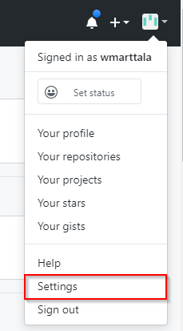
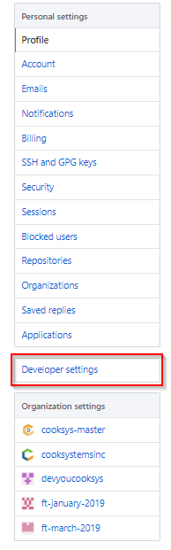
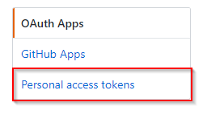
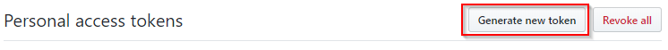
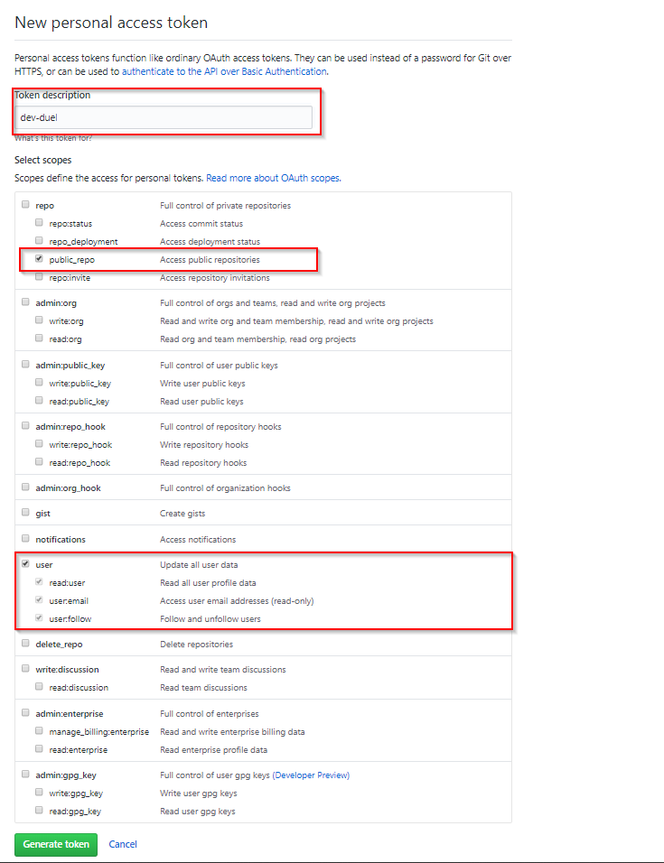
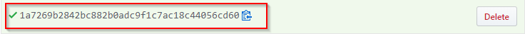
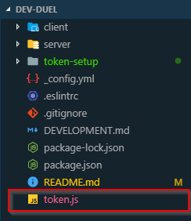
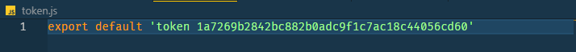
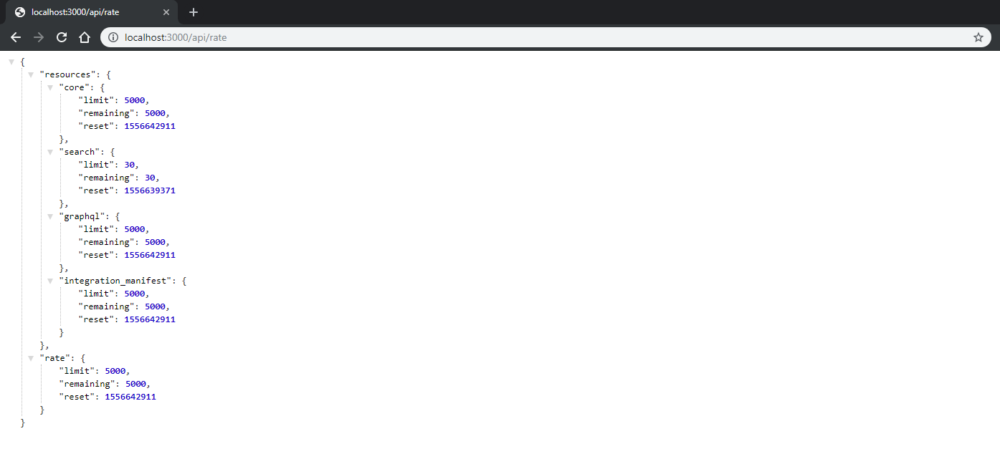

## Setting up the token to work with GitHub

GitHub uses OAuth2 authentication on it's API to restrict access to private routes and rate limit unauthorized access. Authentication with GitHub is already setup in this project, however, you will need to generate your own developer token and add it to a `token.js` file at the top level of the project in order to use the provided authentication method. The steps for this setup are below:

1) Go to [GitHub](http://www.github.com) and select settings in the drop down from the upper-right hand side of the navigation bar.

2) Navigate to `Developer settings` between `Personal settings` and `Organization settings` in the left Navigation.

3) Go to `Personal access tokens`

4) Click `Generate new token` and if prompted for password use your GitHub account password to authorize token creation.

5) In the token generation screen give the token any description you want and select `public_repo` under the `repo` selection and all of the `user` options.

6) Generate the token and copy the newly generated token string.

7) Create a file named token.js at the root of your dev-duel directory.

8) In your newly created token file paste and export the token string you created.

In order to verify your token is properly setup, run the application with the command `npm run serve` and navigate to `localhost:3000/api/rate`. The `"limit"` on the `"rate"` object should be 5000.

